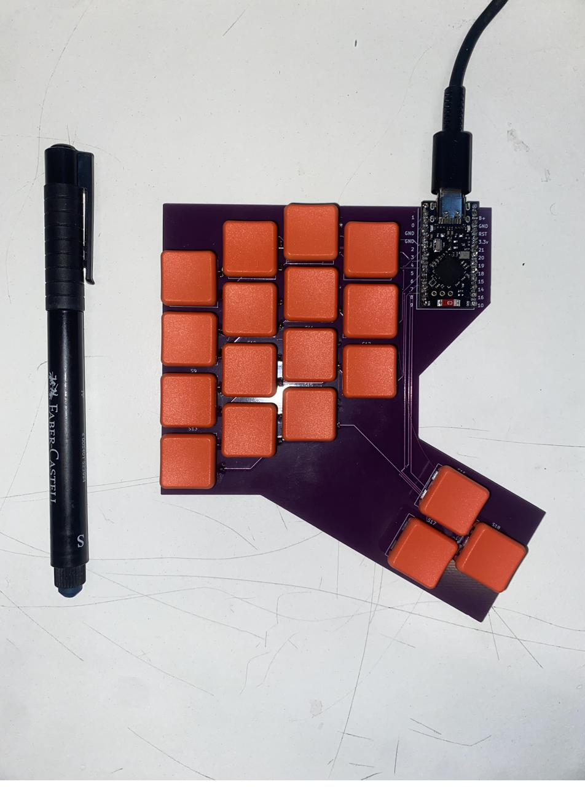
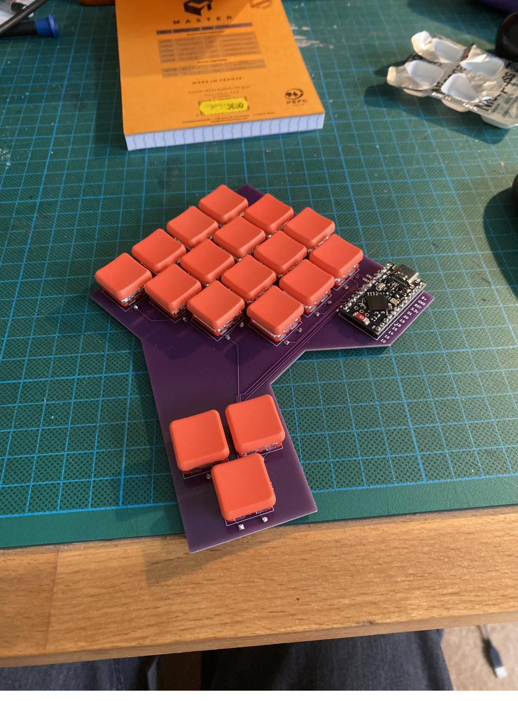
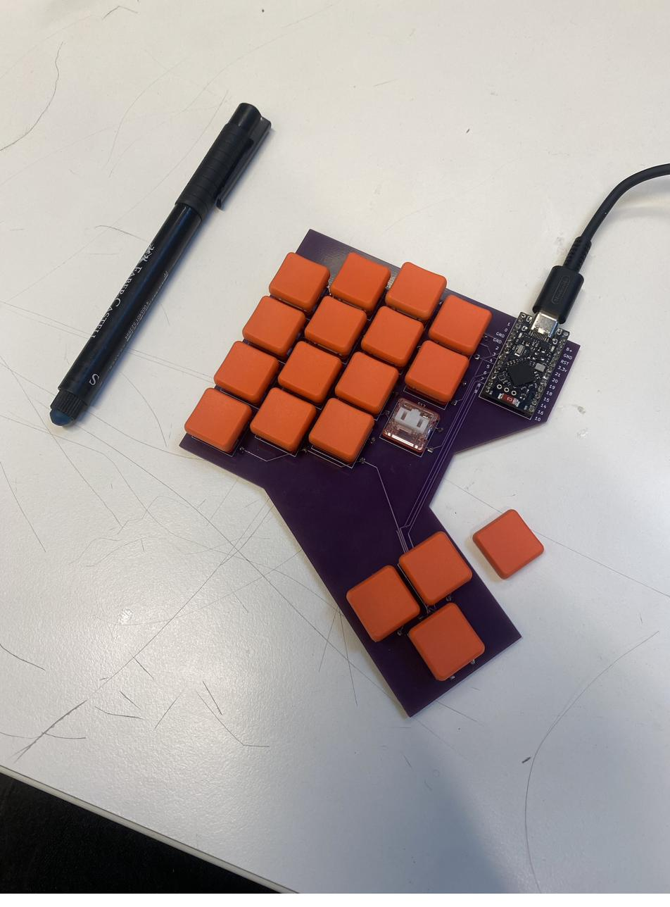
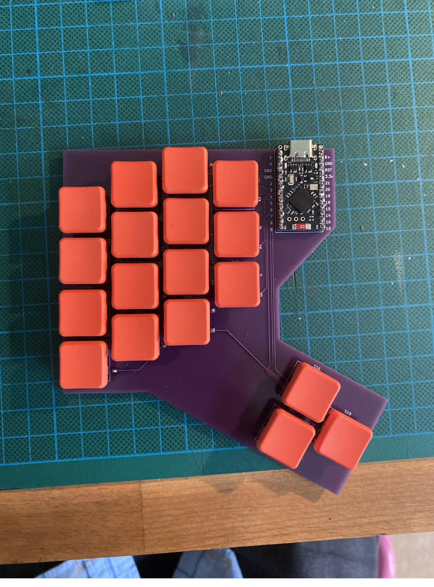

# Blenderpad



A small, 18-key wireless-capable macropad built around the shortcuts I actually use in Blender, with a toggleable numpad layer for viewport navigation.

<p>
  
  
  
</p>

But the keyboard itself is only half of this project. **The real idea is that your Blender workflow is not mine.** Everyone uses different tools, different shortcuts, different hands. So this repository gives you the whole path, from measuring *your* habits to holding *your* keyboard:

1. **Measure** which keys you really press in Blender, with a small add-on.
2. **Design** a layout that fits those keys.
3. **Draw** the PCB, order it, solder it.
4. **Flash** a firmware and tweak your keymap until it feels right.

Take my files as a starting point, not as the answer. Change the number of keys, move them around, swap the shortcuts. Experiment!

---

## Repository contents

```
addon/        KeyPressTracker, the Blender add-on that counts your key presses
hardware/     KiCad project, production-ready Gerbers, 3D model, schematic PDF, BOM
boards/       ZMK shield definition (matrix, pins, keymap)
config/       ZMK configuration
docs/         Keymap customization guide and blank keymap template
images/       Photos used in this README
build.yaml    Tells GitHub which firmware to build
```

---

## Step 1 — Find your keys with KeyPressTracker

KeyPressTracker is a small Blender add-on that counts every key and shortcut you press, so you can base your layout on real data instead of guesses.

### Install

Requires Blender 4.2 or newer.

1. Download the `.py` file from [`addon/`](addon/).
2. In Blender, go to `Edit → Preferences → Add-ons`.
3. Click the small arrow in the top-right corner of the add-ons list. A menu opens: choose **Install from Disk**.
4. Select the `.py` file. KeyPressTracker appears in the list, already enabled.

### Save your .blend file first

**Save your Blender file before you start tracking.** By default, the results are written to `key_counts.csv`, **in the same folder as your .blend file**. If the file has never been saved, Blender doesn't know where that folder is, and the results can't be written. You can also pick another location with the **File** field in the panel.

### How it works

In the 3D viewport, open the sidebar (`N`) and go to the **KeyPressTracker** tab.

1. Click **Start**, then work in Blender exactly as usual. The status switches to *Running*.
2. Every key you press is counted, along with its modifiers: `G`, `Shift+A`, `Ctrl+Z`, `NUMPAD_7`... Mouse clicks and the automatic repeats of a held key are ignored.
3. The panel shows your top 10 live, and the total number of presses.
4. Click **Stop** when you're done: the counts are saved to the CSV file. **Save** writes the file at any time without stopping, **Reset** clears all counts (with confirmation).

Opening another .blend file stops the tracking. Just click **Start** again.

Let it run over several real working sessions, not a five-minute test: the more data, the more honest the result.

### What to do with the results

The CSV file has two columns, the key and the number of presses, sorted from most to least used. Open it in any spreadsheet (Excel, LibreOffice, Google Sheets).

- **The top of the list is your keyboard.** My 18 keys came from roughly the top of mine. Decide how many keys you want, and keep that many from the top.
- **Look at the modifiers.** If `Shift`, `Ctrl` or `Alt` show up a lot, alone or in combos, give them dedicated keys. A shortcut like `Shift+A` can also be a single key on its own.
- **Look at the numpad keys.** If `NUMPAD_1`, `NUMPAD_3`, `NUMPAD_7` rank high, you navigate the viewport with the numpad, and a numpad layer like mine is worth it.
- **Spot the surprises.** Some keys you thought you used all the time won't be there, and the other way around. That's exactly why this step exists.

Then group the keys by how you use them (transform, selection, modes, views...) and move on to the layout.

---

## Step 2 — Design a layout with Ergogen

Before committing to a PCB, I iterated on the layout with [Ergogen](https://ergogen.xyz/), which describes a keyboard in a text file. Writing a layout as code is intimidating at first, but it lets you change the number of keys or their spacing in seconds, and that freedom is exactly what you want at this stage.

This tutorial makes it click very quickly, I highly recommend it: **[Ergogen introduction by FlatFootFox](https://flatfootfox.com/ergogen-introduction/)**

Good to know: Ergogen's web preview shows key positions but not components like diodes or switches. You only see those once the output is opened in KiCad. I ended up doing the electronics directly in KiCad.

---

## Step 3 — Draw the PCB in KiCad

I learned to design a keyboard PCB in KiCad with this video, which I highly recommend: **[KiCad keyboard PCB tutorial](https://www.youtube.com/watch?v=8WXpGTIbxlQ&t=162s)**

All footprints and 3D models come from the excellent **[ScottoKicad library](https://github.com/joe-scotto/scottokeebs/tree/main/Extras/ScottoKicad)** by Joe Scotto. It is **not included** in this repository: install it yourself if you want to edit the design.

The KiCad files in [`hardware/kicad/`](hardware/kicad/) open without the library, because the PCB file keeps a copy of every footprint. You only need ScottoKicad to add new parts, update footprints, or see the 3D view (the 3D models use the `${SCOTTOKEEBS_KICAD}` path variable, which the library's install guide explains how to set).

**Just want to build mine?** [`hardware/gerbers/`](hardware/gerbers/) contains the production-ready files. Upload the `.zip` to any PCB manufacturer (JLCPCB, PCBWay...). Standard settings: 2 layers, 1.6 mm.

Also in [`hardware/`](hardware/): the schematic as a PDF, a STEP model to design a case around the PCB, and the [bill of materials](hardware/BOM.md).

### The matrix

18 keys wired as a 6 columns × 4 rows matrix, one 1N4148 diode per key, `col2row` orientation (the diode's cathode, the black band, points to the row).

| | col 1 | col 2 | col 3 | col 4 | col 5 | col 6 |
|---|---|---|---|---|---|---|
| row 1 | S1 | S2 | S3 | S4 | | |
| row 2 | S5 | S6 | S7 | S8 | | |
| row 3 | S9 | S10 | S11 | S12 | | |
| row 4 | S13 | S14 | S15 | S16 | S17 | S18 |

Controller pins (Pro Micro labels, as printed on the PCB): columns 1–6 on `21, 20, 19, 18, 15, 14`, rows 1–4 on `4, 5, 2, 3`.

---

## Step 4 — Build it

**Parts:** see the [BOM](hardware/BOM.md). Kailh Choc V1 switches, 1N4148 through-hole diodes, and a nice!nano v2 or a compatible clone.

**Soldering order:** diodes first (flattest), then the controller, then the switches last, so they don't block access to everything else. Solder one leg of each diode, check it sits flat and in the right direction, then solder the second.

**Before the first power-on:** inspect for solder bridges, especially on the controller. If you have a multimeter, check there is **no** continuity between `GND` and `3.3v`.

---

## Step 5 — Flash the firmware (ZMK)

The firmware is built automatically by GitHub, no installation needed.

1. **Fork** this repository. GitHub Actions builds the firmware on every push.
2. Open the **Actions** tab, select the latest green run, and download the file under **Artifacts**. Unzip it to get a `.uf2` file.
3. Plug the keyboard in via USB and enter flash mode: short **`RST` to `GND` twice quickly** (tweezers or a piece of wire work fine; the two holes are next to each other on the PCB). A drive named `NICENANO` appears.
4. Drag the `.uf2` onto that drive. It disconnects by itself when done: that's normal.

Once the firmware is installed, the bootloader key on the numpad layer does step 3 for you.

### Default keymap

The firmware sends **positions**, not letters (see the AZERTY pitfall below). The labels here are what you get with a **French AZERTY** layout on the computer.

```
Main layer                       Numpad layer (toggled)
M    B    A    D                 1    2    3    4
X    Y    Z    G                 5    6    7    8
S    E    I    R                 9    0    .    Enter
Alt  Num  N    Shift Ctrl Tab    Alt  Num  BOOT Shift Ctrl Tab
```

`Num` toggles the numpad layer on and off. The numbers are **numpad** keys, the ones Blender uses for viewport views.

**Make it yours:** the [customization guide](docs/customize.md) explains the keymap syntax, and [`docs/template.keymap`](docs/template.keymap) is a blank template to start from.

---

## Numpad indicator: using the controller's LED

The red LED on the SuperMini (and on the nice!nano) is a *user LED* wired to GPIO `P0.15`. This project uses it as a numpad layer indicator, without adding any component, thanks to the small [zmk-led-indicator](https://github.com/northwestisthebest/zmk-led-indicator) module.

Two pieces make it work:

- [`config/west.yml`](config/west.yml) declares the module (with `revision: main`, since the module has no ZMK-version branches).
- The shield overlay declares the LED and the layer it watches:

```dts
led_indicator: led_indicator {
    compatible = "zmk,led-indicator";
    gpios = <&gpio0 15 GPIO_ACTIVE_HIGH>;
    indicate-layer = <1>;
};
```

The **blue** LED on the SuperMini is hardwired to the battery charger and cannot be controlled. Without a battery, it blinks forever. A piece of tape does the trick.

---

## Beginner pitfalls (I fell into all of them)

**Using a clone instead of a nice!nano.** The SuperMini nRF52840 is a cheap clone with the same pinout, and it works with the `nice_nano_v2` board in ZMK. But it has **13 pins per side** instead of 12: the two extra pins at the top, `B+` and `B−` (battery), hang over the edge of a nice!nano footprint. Align the rest (`GND` in `GND`, `RST` in `RST`) and **check the alignment before soldering**. Its three extra bottom pins don't match the nice!nano's either: leave them alone.

**AZERTY (and other non-QWERTY layouts).** ZMK sends key *positions* as if the computer were in QWERTY, and the operating system translates them. With a French AZERTY layout, `&kp Q` types **A**, `&kp W` types **Z**, and `&kp SEMI` types **M** (and the other way around for A and Z). Write your keymap accordingly and test a few keys after flashing.

**Num Lock.** Numpad keys only produce numbers if Num Lock is on in the operating system. Otherwise they act as Home, End, arrows... and in Blender, Home means "frame all". Num Lock is a system-wide state, so turning it on once (from another keyboard or the on-screen keyboard) is enough.

**Tracks that refuse to enter a footprint in KiCad.** If a track stops dead at the outline of a module, the footprint probably contains **Rule Areas** (keepout zones). Check in the footprint editor and remove them if they're not needed.

**KiCad libraries outside the project folder.** They won't exist on anyone else's computer. Keep project-specific libraries inside the project folder and reference them with `${KIPRJMOD}`.

**Diode direction.** All diodes must face the same way, black band towards the row. If you soldered all of them backwards, no need to desolder: change `diode-direction` to `"row2col"` in the overlay.

**Charge-only USB cables.** The keyboard lights up but the computer doesn't see it. Use a cable that carries data.

**Editing ZMK files with Notepad.** Save as *All files* with UTF-8 encoding, and check that Windows didn't silently add `.txt` to the file name.

---

## Licenses

- **Add-on** ([`addon/`](addon/)): GPL-3.0-or-later, as required for Blender add-ons.
- **Firmware configuration**: MIT, like ZMK itself.
- **Hardware** ([`hardware/`](hardware/)): CC BY-NC-SA 4.0, matching the ScottoKicad footprints it is built on. You may build, modify and share it, but not sell it.

## Credits

- [ScottoKicad](https://github.com/joe-scotto/scottokeebs/tree/main/Extras/ScottoKicad) by Joe Scotto, for every footprint and 3D model (CC BY-NC-SA 4.0).
- The [KiCad keyboard tutorial](https://www.youtube.com/watch?v=8WXpGTIbxlQ&t=162s) that taught me PCB design.
- [FlatFootFox's Ergogen introduction](https://flatfootfox.com/ergogen-introduction/).
- [ZMK Firmware](https://zmk.dev/) and [zmk-led-indicator](https://github.com/northwestisthebest/zmk-led-indicator).
